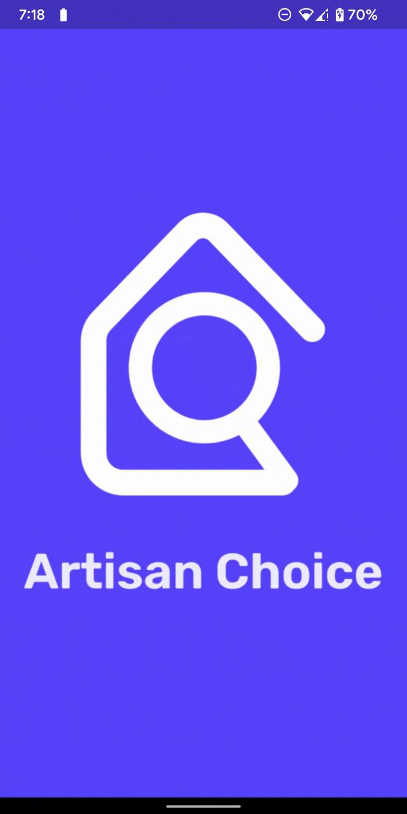
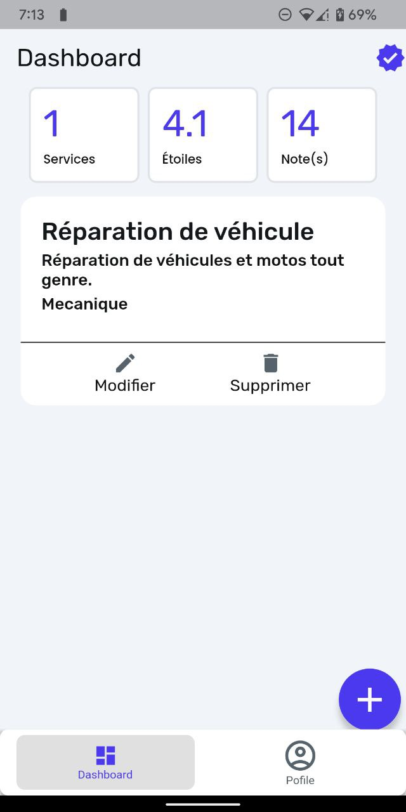

# Artisan Choice

##### Working in a team of two, designed and developped a mobile application which brought together several service providers and their customers using their location to bring users fast service delivery and proximity.

## Demo

##### 🥲 Unfortunately, this project is not deployed on Google play and App Store.

## Screenshots

##### 1- Splash Screen.

##### 2- Home Page.
 

##### 3- Artisans list.

##### 4- Services list.

##### 5- Register and Login screens.
 

##### 6- Dashboard and profile screens.
 

## Technologies Used

##### Flutter 🚀

##### Firebase 🔥.

## Features

##### - Create a client or an artisan account
##### - As an artisan, post your services and get noted by clients to get more visibility
##### - As a client, search for a service by location proximity and rates, note the artisan.
